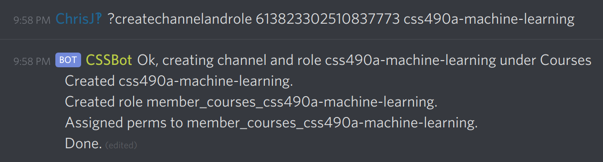
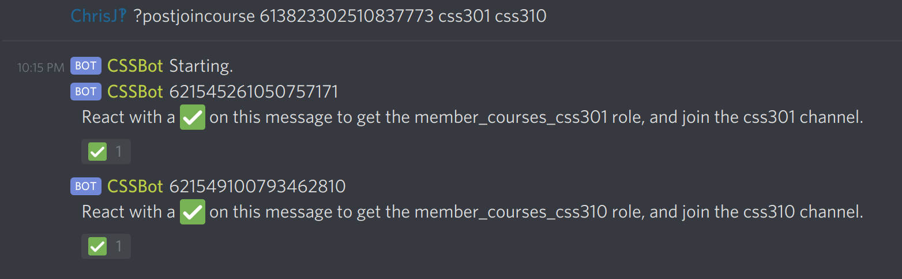

This guide documents how to create course channels for the server.
If it is not kept up to date, I suggest you refer to
the [source code] for all of the details that may be lacking here.

## How Course Channels Work

Course channels are created automatically by CSSBot. They inherit the role
permissions set by the "Courses" channel category, but also add two
permissions on top:

- The `@everyone` role has "Read Messages" set to Deny
- The `member_XXX_YYY` role has "Read Messages" set to Allow, where XXX is the category name, and YYY is the channel name.

This means that for each channel there is a corresponding role, and each
member of that channel has to have that role in order to see it.
This was done as a way of allowing users to opt-in to channels.

The bot uses the name of the channel and the name of the role to correlate them. **Do not rename the roles or channels generated by CSSBot.**
While it _could_ work it has not been tested.
If you need to rename a new channel that hasn't been used yet,
just delete it and create a new one.

When a user reacts to a "react to this message" post, the bot checks
the conditions that:

- The user is not a bot
- The user reacted to CSSBot's message
- The message begins with a Role Id (this is the one that is assigned)

If all of these pass, the parsed role Id is assigned to the user,
and they appear to be "added" to the channel.

## How to use CSSBot to manage course channels

**You will need the "Manage Channels" server permission at least.**
_Some_ require the "Administrator" permission.

You should probably enable the "Developer Mode" in the desktop
client settings so that you can easily right-click
on users, roles, and channels to get their IDs.

### Creating Course Channels and Roles

Course channels can be created using the following command:

```
?createchannelandrole <category id> <name>
?createchannelandrole 613823302510837773 css101
```

Where `<category id>` is the Id of the category to create the channel under.
`<name>` is the name of the channel (and the role) that you want to create.
Ensure that the name follows Discord's naming restrictions (no whitespace, etc).



While running this operation, the response message will provide some
feedback. It's best to do this in a private channel.

### Allowing users to join the channel

As an Administrator, you are able to add users to roles for them.
This works for a few, but not for 500 people.

_Note:_ There are two commands that are relevant to this, "PostJoinRole"
and "PostJoinCourse". "PostJoinRole" is potentially dangerous, as it
allows users to join any role that is lower than CSSBot's highest role.
**You don't want to use "PostJoinRole".**

**PostJoinCourse** allows you to create one-to-many "react to this message
to join" messages. This is what is used to allow users to join.

```
?postjoincourse <category id> <list of course codes>
?postjoincourse 613823302510837773 css301 css310
```

`<category id>` is the Id of the category to create the channel under.
`<list of course codes>` is the list of the courses to create invite
messages for. They must already exist and have a matching role name.
If one is not found, the bot will respond with error text, but continue.
The list of course codes must be whitespace separated.

This must be done in a public facing channel. It's best that you delete your message and the error messages when you are done.



### Sorting a channel category alphabetically

Doing this by hand is a pain.
This sorts the channels alphabetically in a category.
This is not easy to reverse, so don't do it unless you are
sure.

```
?sort <channel category id>
```

### Clearing the channels at the end of the quarter

For a few reasons, we plan on deleting and re-creating the
course channels at the end of each quarter before the next one
begins. New channels should not be created for each quarter,
but they can be added if any classes are missing.

**This can be very destructive. Only users with the Administrator role can do this.**

The "NukeAndRebuildCurrentChannel" command will:

- Save the settings of the current channel.
- Delete it. This erases all of the messages.
- Re-create the channel.
- Apply the old settings to the new channel.

Effectively this will wipe the channel clean. This should only be done with a week's notice.

This command must be run within the channel you are trying to
nuke and rebuild.

```
?NukeAndRebuildCurrentChannel #textChannelMention <text channel id> <text channel name>
```

Where the parameters are the mentioned text channel `#channelName`, ID of the channel, and the name of the channel.
These checks are done to prevent mistakes.

Roles and webhooks will be copied over.
**Pinned messages won't be saved.**

[source code]: https://github.com/Chris-Johnston/CSSBot/blob/master/CSSBot/Services/Courses/Commands/CourseChannelModerationCommands.cs